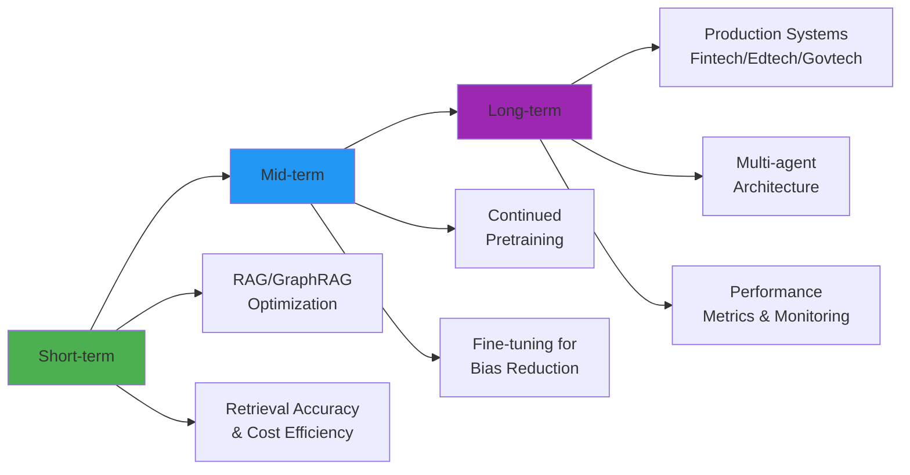

<div align="center">

# 👋 Hi, I'm Tu Ha Phuc (Từ Hà Phúc)

[;Vietnamese+NLP+Specialist;Building+RAG+%26+Multi-Agent+Systems;Fine-tuning+%26+Continued+Pretraining)](https://git.io/typing-svg)

### 🚀 Specialized in LLM-powered Applications for Vietnamese Language

</div>

---

## 👨‍💻 About Me

```python
class AIEngineer:
    def __init__(self):
        self.name = "Tu Ha Phuc"
        self.role = "AI Engineer (NLP/LLM)"
        self.language_focus = ["Vietnamese", "English"]
        self.domains = ["Q&A Systems", "Summarization", "Sentiment Analysis", "Agentic AI"]
        
    def current_focus(self):
        return {
            "short_term": "RAG/GraphRAG optimization, retrieval accuracy & cost efficiency",
            "mid_term": "Continued pretraining + fine-tuning for bias reduction",
            "long_term": "Production-ready multi-agent systems (fintech/edtech/govtech)"
        }
    
    def success_metrics(self):
        return ["latency", "accuracy", "cost-per-query", "user_satisfaction"]
```

---

## 🛠️ Tech Stack

### 🤖 LLM & Frameworks


### ☁️ Cloud & Infrastructure


### 💻 Languages & Tools


---

## 🌟 Featured Projects

<table>
<tr>
<td width="33%">

### 🤖 [Chatbot Agent UEL](https://github.com/TuHaPhuc/chatbot_agent_uel)
**Multi-agent chatbot system**
- 🔹 Python & JavaScript
- 🔹 Agent-based architecture
- 🔹 Vietnamese Q&A system
- 🔹 RAG implementation


</td>
<td width="33%">

### 🎯 [RMIT Hackathon ZipLine](https://github.com/TuHaPhuc/RMIT-Hackathon2025-ZipLine)
**Full-stack web application**
- 🔹 JavaScript, HTML, CSS
- 🔹 Hackathon winner project
- 🔹 Interactive UI/UX
- 🔹 Real-time features


</td>
<td width="33%">

### 📊 [ViBBQ](https://github.com/TuHaPhuc/ViBBQ)
**Vietnamese NLP Research**
- 🔹 Python & Jupyter
- 🔹 Bias detection dataset
- 🔹 Model evaluation
- 🔹 Research experiments


</td>
</tr>
</table>

---

## 📝 Publications

<div align="left">

### 📄 Financial Sentiment Analysis
**"Building a financial sentiment bank on the investment behavior of foreign investors"**  
📌 DOI: [10.32508/stdjelm.v9i1.1548](https://doi.org/10.32508/stdjelm.v9i1.1548)  
🔬 *Research on sentiment analysis in Vietnamese financial markets*

### 📄 Market Analysis
**"News and prices: Vietnam stock market"**  
📌 DOI: [10.32508/stdjelm.v8i4.1479](https://doi.org/10.32508/stdjelm.v8i4.1479)  
🔬 *Studying the relationship between news sentiment and stock prices*

</div>

---

## 🎯 Career Roadmap



### 🔹 Short-term Focus
- Building Vietnamese Q&A systems with **RAG/GraphRAG**
- Optimizing **retrieval accuracy** and **inference cost**
- Experimenting with hybrid search strategies

### 🔹 Mid-term Goals
- **Continued pretraining** on Vietnamese domain-specific corpora
- **Fine-tuning** to reduce bias and increase model reliability
- Building evaluation benchmarks for Vietnamese LLMs

### 🔹 Long-term Vision
- Deploy **multi-agent systems** in production (LangGraph/LangChain)
- Target industries: **Fintech**, **Edtech**, **Govtech**
- Measure success by: `latency`, `accuracy`, `cost-per-query`, `user satisfaction`

---

## 📊 GitHub Statistics

<div align="center">


</div>

<div align="center">

[](https://git.io/streak-stats)

</div>

---

## 🌐 Research Interests

<div align="center">

| Area | Focus |
|:----:|:------|
| 🧠 **NLP** | Vietnamese language understanding, Sentiment analysis, Text classification |
| 🤖 **LLM** | RAG, GraphRAG, Fine-tuning, Continued pretraining |
| 🔗 **Agentic AI** | Multi-agent systems, LangGraph, Tool-using agents |
| 💰 **Fintech** | Financial sentiment analysis, Market prediction |
| 📈 **Optimization** | Retrieval accuracy, Inference cost, Latency reduction |

</div>

---

## 💡 Quote

> *"Building reliable AI systems for Vietnamese language is not just about translation — it's about understanding culture, context, and nuance."*

---

## 📫 Get In Touch

<div align="center">

[](mailto:tuhaphuc04@gmail.com)
[](https://github.com/TuHaPhuc)
[](https://doi.org/10.32508/stdjelm.v9i1.1548)

</div>

---

<div align="center">

### 🚀 Open to collaboration on Vietnamese NLP & LLM projects!


**⭐ Star my repositories if you find them interesting!**

</div>
